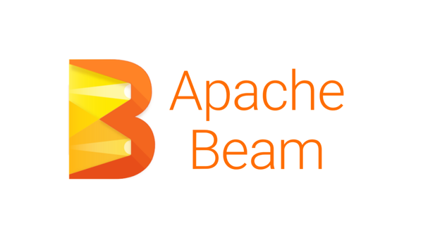
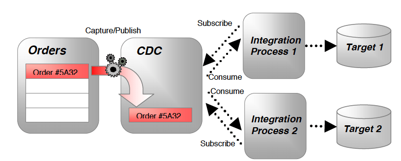
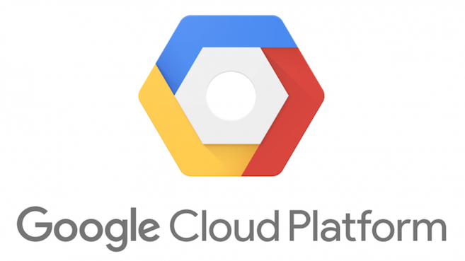
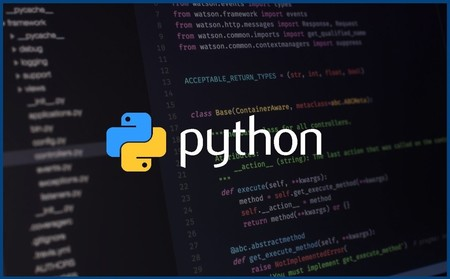
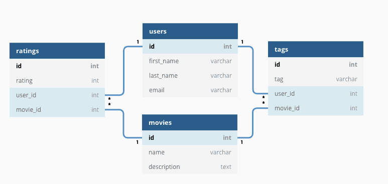

# Big Data & Cloud - Repository - Maximiliano Barrios

## Index

1. [Repository Description](#1-repository-description)

2. [Apache Beam in Java](#2-apache-beam-in-java)

3. [Change Data Capture](#3-change-data-capture)

4. [Google Cloud Platform](#4-google-cloud-platform)

5. [Linux - Scripts and Commands](#5-linux)

6. [PySpark](#6-pyspark)

7. [Python](#7-python)

8. [SQL](#8-sql)

## 1. Repository Description

My name is Maximiliano and I was a Python Developer but now working in Big Data & Cloud (GCP) projects. Preparing to certificate as a Professional Data Engineer in Google Cloud Platform.

This directory includes code and examples related to Big Data Analytics and Processing. Also has some basic operations in Python, SQL, Linux, etc.

Items in this repository:
- [Apache Beam in Java](ApacheBeamJava): directory that contains different sections with Apache Beam Java examples, using standalone runner, Dataproc (GCP), Google Cloud Storage (GCS) or AWS S3.
- [Change Data Capture](CDC_Java_Example): an example of CDC implementation using Dataproc and Apache Beam connectors.
- [GCP](GCP): python scripts and files using some GCP Tools as App Engine, Cloud Functions, PubSub, etc.
- [Linux](Linux): linux commands and basic bash scripts.
- [PySpark](PySpark): PySpark examples (RDDs, dataframes, Spark SQL) and exercises solved using CSV file as input (jupyter notebooks, python scripts and a PDF of results).
- [Python](Python): Basic examples, numpy, matplotlib, OOP and Unit Testing.
- [SQL](SQL): queries, stored procedures, UDF, etc.

→ [index](#index)

## 2. Apache Beam in Java

Java code examples using Apache Beam.

Apache Beam is a Big Data framework to process bounded and unbounded data. Streaming and batch processing can be done using Apache Beam, also has connectors with different cloud tools, platforms or applications.

- [Section 1](ApacheBeamJava/section1): example to check Apache Beam and Maven dependencies.
- [Section 2](ApacheBeamJava/section2): entities, reading a file and customizing options.
- [Section 3](ApacheBeamJava/section3): filter, flatten, map, ParDo, Partition and SideInput.
- [Section 4](ApacheBeamJava/section4): Count, Distinct and GroupByKey.
- [Section 5](ApacheBeamJava/section5): InnerJoin, LeftJoin, RightJoin.
- [Section 6](ApacheBeamJava/section6): Options, Parquet Read/Write and S3.
- [Section 7](ApacheBeamJava/section7): HDFS, JDBC IO, MongoDB.
- [Section 8](ApacheBeamJava/section8): Real Time Streaming, Kafka, Deserializer.
- [Section 9](ApacheBeamJava/section9): SQL like queries, Count, Join.
- [Section 10](ApacheBeamJava/section10): Dataflow Pipelines, BigQuery Connector.

→ [index](#index)

## 3. Change Data Capture

In this section, we can found a Java code example using PubSub as input (reading a JSON from the topic), process data and write to BigQuery. Originally, Debezium was used to establish a connection between a relational database (SQL) and publish changes in a PubSub Topic. Pipeline runs in Dataproc.

- Java file: [CDC Test](CDC_Java_Example/CDCTest.java)
- JSON message example from PubSub: [link to message](CDC_Java_Example/message_topic.json)
- Dependencies: [POM file](CDC_Java_Example/pom.xml)
- Project Config: [JSON config file](CDC_Java_Example/ProjectConfig.json)
- BigQuery table schema: [BQ schema](CDC_Java_Example/BigQuerySchema.java) and [row example](CDC_Java_Example/CustomersDataExample.json)

→ [index](#index)

## 4. Google Cloud Platform

Python example using different GCP modules:
- [AVRO and GCS](GCP/avro): reading and transforming an avro file (local and using GCS).
- [BigQuery and Airflow](GCP/bigquery): orchestrating a table copy to different regions using BigQuery and Apache Airflow.
- [Cloud Functions](GCP/cloud_function_to_pubsub): publishing to a topic using a Cloud Function and PubSub.
- [CloudSQL](GCP/CloudSQL): solving an exercise in CloudSQL.
- [App Engine](GCP/flask_app_engine): deploying an app using Flask, GCS and avro in GCP.
- [NoSQL](GCP/NoSQL): indexation and queries examples in DataStore.
- [Sending messages to PubSub](GCP/send_message_to_topic_pubsub): automatization using python to send multiple messages to PubSub (multiprocess, args with command line, custom input file).

→ [index](#index)

## 5. Linux

Most common commands and basic bash scripts examples. 

(SECTION IN PROGRESS)

→ [index](#index)

## 6. PySpark

Solving 2 excercises in PySpark. Spark is a Big Data Framework based on Hadoop. It can process batch or streaming.

In this section you can find:
- PDFs presentation with results ([PDF_exercise_1](PySpark/ej_1.pdf) - [PDF_exercise_2](PySpark/ej_2.pdf))
- Python Code ([exercise_1.py](PySpark/python_code/ej_1.py) - [excercise_2.py](PySpark/python_code/ej_2.py))
- Jupyter Notebooks ([notebook_exercise_1](PySpark/jupyter_notebooks/ej_1.ipynb) - [notebook_exercise_2](PySpark/jupyter_notebooks/ej_2.ipynb))
- Input Data: [data.csv](PySpark/example_data/web.csv)

→ [index](#index)

## 7. Python

Python scripts using some libraries.

In this section:
- [Basic Examples](Python/BasicExamples): generators, decorators, closures.
- [Differential Equations](Python/Differential_Equations): solving differential equations with ODE, numpy and matplotlib to show results.
- [OOP and Unit Testing](Python/POO_example_Matrix): designing a class and testing methods.

→ [index](#index)

## 8. SQL

(SECTION IN PROGRESS)

→ [index](#index)