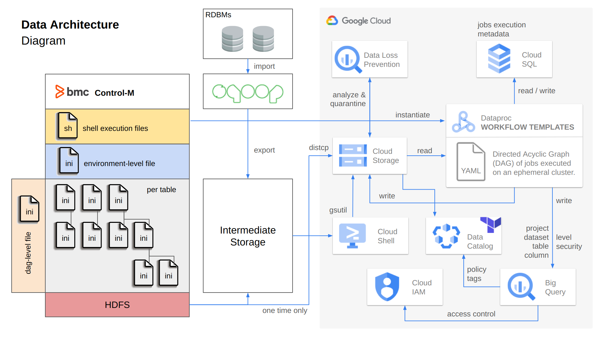
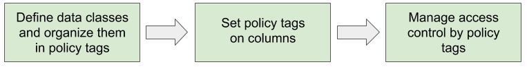
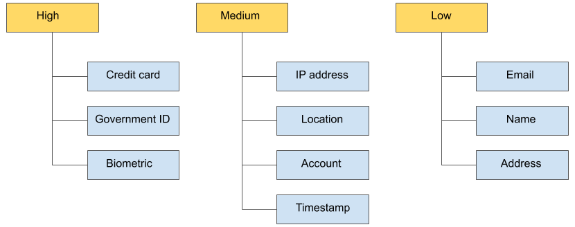
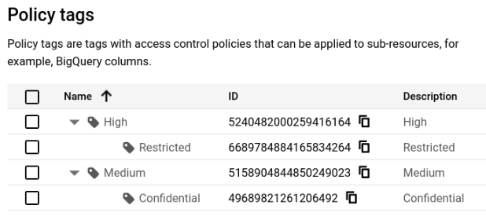

# Dataproc Workflow Templates


## Index

1. [Project](#1-project)

&nbsp;&nbsp;&nbsp;&nbsp;&nbsp;&nbsp;&nbsp;&nbsp;1.1 [Project Description](#11-project-description)

&nbsp;&nbsp;&nbsp;&nbsp;&nbsp;&nbsp;&nbsp;&nbsp;1.2 [Architecture Diagram](#12-architecture-diagram)

2. [Dataproc Workflow Templates](#2-dataproc-workflow-templates)

3. [Data Catalog (Taxonomies and Policy Tags)](#3-data-catalog)

4. [Jobs](#4-jobs)

5. [Tutorial: Instantiation and Execution](#5-tutorial-instantiation-and-execution)

6. [Appendix](#6-Appendix)

## 1. Project

#### 1.1 Project Description

The objective of the project is to implement Dataproc Workflow Templates functionality combined with BigQuery column-level security. It is composed by four main jobs, orchestrated by Dataproc Workflow Templates, that perform simple transformations with Apache Spark (RDD and Dataframe API), reads data from GCS (source), and utilizes the Dataproc BigQuery connector to sink the transformed data to BigQuery. The last job of the process performs the BigQuery schema update by binding Policy Tags to the correspondent BigQuery table columns (in sync with IAM roles and member definitions).

The metadata associated to the Policy Tags binding, will be read from a Cloud SQL instance, where the column name and the required permissions will be obtained by a SQL query against it. BigQuery table schema will be either updated or not depending on if it suffered changes by comparing the Cloud SQL Metadata against the current version of the BigQuery table schema.
#### 1.2 Architecture Diagram



Items in this repository:
- [Workflow-Templates](template): YAML files that contain cluster parametrization and DAG definition (sequence of jobs to run either in parallel or concurrently).

- [Jobs](jobs/pgm-1.py):
    - [Job1](jobs/pgm-1.py): Spark RDD API and GCS as the source.
    - [Job2](jobs/pgm-2.py): PySpark job, GCS as the source and BigQuery as the sink.
    - [Job3](jobs/pgm-3.py): Reads metadata from a table in a Cloud SQL instance and updates a BigQuery table schema, binding Policy Tags (defined in DataCatalog) to BigQuery table columns.
    - [Job4 and 5](jobs/pgm-4.py): Cleans temporary data from GCS bucket.
    
- [Terraform files](terraform) to create Taxonomies and Policy Tags.

## 2. Dataproc Workflow Templates

Workflow Templates provides an easy way to manage and execute workflows, establishing a Directed Acyclic Graph (DAG) of jobs in a cluster that can be either ephemeral or persistent (you can specify a persistent cluster by using a cluster selector property).

#### 2.1- Executing Workflow Templates
This repository covers both ways available in Dataproc Workflow Templates to execute a DAG:
- _INLINE_: Use a YAML to directly instantiate a Workflow, without creating a template resource. This can be done from any system with Google Cloud SDK installed (local system, or Cloud Shell).
```
gcloud dataproc workflow-templates instantiate-from-file --file=template-no-param.yaml --region=us-east1
```
    
- _IMPORT + INSTANTIATE TEMPLATE_: Import the YAML file to create a Dataproc Workflow Template resource, and use custom parameters by command line to instantiate it afterwards.

    - First import the workflow-template.yaml file:

          gcloud dataproc workflow-templates import template-with-param --region=us-east1 --source=template-with-param.yaml

    - Then instantiate:

          gcloud dataproc workflow-templates instantiate template-with-param --region=us-east1 --parameters=JOB1_PROGRAM=gs://gcs-dataproc-workflow-templates/pgm-1.py,JOB2_PROGRAM=gs://gcs-dataproc-workflow-templates/pgm-2.py,JOB3_PROGRAM=gs://gcs-dataproc-workflow-templates/pgm-3.py,JOB3_JARFILEURI_1=gs://gcs-dataproc-workflow-templates/postgresql-42.2.23.jar,JOB4_PROGRAM=gs://gcs-dataproc-workflow-templates/pgm-4.py,GCS_INPUT=gs://gcs-dataproc-workflow-templates/titanic.csv,GCS_OUTPUT=gs://gcs-dataproc-workflow-templates,TITANIC_CLASS=2,TABLE_BQ=<<PROJECT_ID>>.<<DATASET_ID>>.titanic_survived,TAXONOMY_PARENT=projects/<<PROJECT_ID>>/locations/us,TAXONOMY=PII,GCS_BUCKET=gs://gcs-dataproc-workflow-templates,FOLDER1=app1_result/,FOLDER2=temp/,NUM_INSTANCES_MASTER=1,NUM_INSTANCES_WORKER=2

The IMPORT + INSTANTIATE TEMPLATE execution way is ideal when there's no need to change the MachineTypeUri configuration for Master and Worker Nodes of the cluster as this specific property is not parametrizable. Check the documentation to understand whether to use this approach or not based on which properties are parametrizables and which of them not for cluster and jobs.

The INLINE method doesn't leverage the ability of utilizing a pre-defined fully parametrizable template, but on the other hand, gives you the ability to build it programatically and dinamically to satisfy each DAG execution needs.

#### 2.2- YAML file structure:
- Managed Cluster: set a job to run and delete the cluster after the workflow is completed.
  - Metadata and Initialization Actions: used to install connectors and execute initialization bash scripts.
  - Region
  - Cluster name
  - Service Account Scopes: necessary credentials to use others GCP services with Dataproc.
  - Others general settings of the cluster (dependencies to be installed, master / workers configuration, etc)
  - Metadata: Proxy SQL and BigQuery initialization actions property / values.
  
- Jobs: definition of jobs .
  - PySpark jobs
  
- Paremeters: definition of parameters for each of the DAG jobs.
  - Args
  - Name
  - Fields
  

## 3. Data Catalog

Data Catalog is a fully managed, scalable metadata management service in Google Cloud's Data Analytics family of products. For this project, we utilize one of the different functionalities Data Catalog provides, which corresponds to the creation of Policy Tags in order to set column-level security in a BigQuery table. Refer to the following link to explore the other functionalities available not covered on this project.

Data Catalog's documentation: https://cloud.google.com/data-catalog/docs/concepts/overview




#### 3.1- Taxonomies
A taxonomy is a group of Policy Tags, organized in a hierarchical structure of nodes, being it the top level node of the hierarchy. For this example we will create the taxonomy called 'PII', which stands for Personal Identifiable Information.

#### 3.2- Policy Tags
Policy Tags are used to assign fine-grained access to sensitive columns. They belong to a taxonomy, are organized in a hierarchical structure and are validated at query time, to verify whether a user has proper access and can access the data on a column / set of columns in the same or different table/s.

'High' and 'Credit Card' are both Policy Tags, however, the first one is at a higher level in the hierarchy, meaning that you can either apply a single tag, such as 'Credit Card', or a group of tags, such as 'High', which will restrict the access to all the tags haging from it, which are 'Credit Card', 'Government ID' and 'Biometric'.



#### 3.3- Data Catalog API with Python
Data Catalog Libraries and dependencies used in this example with Python are available in the following Google official URL: https://googleapis.dev/python/datacatalog/latest/index.html. It is important to mention that the display name of taxonomies / policy tags aren't enough to perform API calls. It is mandatory to employ the resource URI of the taxonomy / policy tag.

## 4. Jobs
#### 4.1- [Job 1](jobs/pgm-1.py)
Spark job that reads a file from Google Cloud Storage that contains the well-known titanic dataset, applies a simple RDD Transformation and writes the result to a new file. Command line arguments list:

- (1) Input File: GCS input file path.
- (2) Titanic Priority Class: possible values 1 or 2 or 3.
- (3) Output File: GCS output file.

#### 4.2- [Job 2](jobs/pgm-2.py)
PySpark job that reads the output from the previous job (stored in Google Cloud Storage) and uses the Dataframe API to perform a simple aggregation. Results are written on a BigQuery table. 
Command line arguments list:
- (1) Bucket Path: GCS bucket that contains the output from the previous job.
- (2) BigQuery Table: fully qualified name of the table (project.dataset.table).

#### 4.3- [Job 3](jobs/pgm-3.py)
This job reads metadata from a Cloud SQL instance, that contains the correspondent policy tags bindings to BigQuery table columns. Loops and conditionals are performed to apply changes / updates to the BigQuery table schema. 
Command line arguments list:
- (1) BigQuery Table: fully qualified name of the table (project.dataset.table).
- (2) Taxonomy Parent: project/<project name>/locations/<location>.
- (3) Taxonomy Display Name

#### 4.4- [Job 4 and 5](jobs/pgm-4.py)
These jobs delete temporal folders / files created by the Dataproc Cluster and BigQuery load job.

## 5. Tutorial: Instantiation and Execution

1- Create a Cloud SQL instance with PostgreSQL.

2- Create your database (either through the Cloud Console or the Cloud SDK Shell), name it: 'jobs-metadata'

Connection can be established using Google SDK:
-       gcloud sql connect jobs-metadata --user=postgres

3- Create a table called 'metadata' that contains information about columns and privacy settings. 
-     Create a table in PostgreSQL with 3 columns and the following schema:
      - table_id
      - column_name
      - description
      
         Column    |          Type          | Collation | Nullable | Default
      -------------+------------------------+-----------+----------+---------
       table_id    | character varying(20)  |           |          |
       column_name | character varying(50)  |           |          |
       description | character varying(500) |           |          |

4- Insert some values
-     // PostgreSQL query to instert into metadata table
      INSERT INTO public.metadata VALUES ('titanic_survived','survived','parameter1=value1;parameter2=value2;CON=Public');
      INSERT INTO public.metadata VALUES ('titanic_survived','total','parameter1=value1;parameter2=value2;CON=Restricted');

5- Check values:
-     SELECT * FROM metadata;
       titanic_survived | survived    | parameter1=value1;parameter2=value2;CON=Public
       titanic_survived | total       | parameter1=value1;parameter2=value2;CON=Restricted

Note: the 'CON' parameter is the one we are interested in. The third program of this DAG will evaluate the value on it to either perform or not the BigQuery Schema Update for the table being processed.

6- Create BigQuery table:
-     CREATE TABLE `<<PROJECT_ID>>.<<DATASET_ID>>.titanic_survived`
      (
        survived STRING NOT NULL,
        total INT64 NOT NULL
      );

7- Create a bucket where all files and templates will be placed:
-      gsutil mb -p PROJECT_ID -c STORAGE_CLASS -l BUCKET_LOCATION

in this example, we have named our multi-region bucket (US): gs://gcs-dataproc-workflow-templates

8- Copy all files (*.py and *.csv) in the bucket.

9- In Data Catalog:
  - Create Taxonomy: 'PII'
  - Create Parents Policy Tags: 'High' and 'Medium'
  - Create Children Policy Tags: 'Restricted' (under 'High') and 'Confidential' (under 'Medium').



##### Optional: Use Terraform to automatize the Policy Tags creation.


In Cloud Shell:
- 1. Create 'policy-tag' folder
- 2. Upload the 3 files:
	- main.tf: this file contains resource instantiation and steps.
	- dev.tfvars: this terraform file contains values for variables that belongs to the deployment environment.
	- variables.tf: contains variables types to use in deployment.
- 3. Run: 
     -      cd:/policy-tag
- 4. Run:
     -      terraform init
- 5. Run 
     -      terraform plan --var-file="dev.tfvars"
  In this step you can see all resources and changes to apply.
- 6. Run 
     -      terraform apply --var-file="dev.tfvars"

Note: you may define the backend on Google Cloud Storage to persist and unify the last deployment status in a GCS bucket, to only deploy resources or apply changes that do not exist in the last saved state (defined in [main.tf](terraform/files/main.tf) file) 
-     terraform {
        backend "gcs"{
            bucket  = "gcs-dataproc-workflow-templates"
            prefix  = "terraform/state"
          }
      }

10- Now you can execute Dataproc-Workflow-Template using INLINE or CREATE + INSTANTIATE TEMPLATE steps (see → [Executing Workflow Templates](#21--executing-workflow-templates)).

### Results:

Now Policy Tags in BigQuery table schema should be updated and visible.

## 6. Appendix
This section contains a link to a jupyter notebook that was used to test and interact with Data Catalog and BigQuery Google APIs.

[Jupyter Notebook Link](jupyter-notebook/Notebook.ipynb)

→ [index](#index)